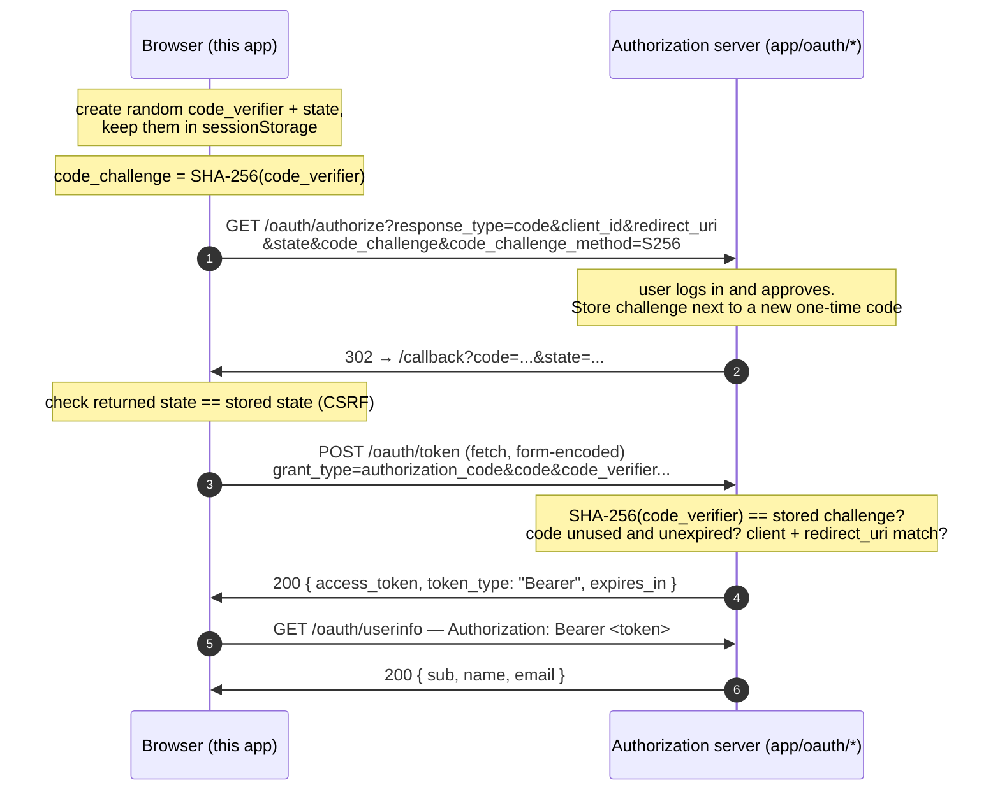

# OAuth 2.0 + PKCE, from scratch

An educational Next.js app that implements the **OAuth 2.0 Authorization Code
flow with PKCE** ([RFC 6749](https://datatracker.ietf.org/doc/html/rfc6749) +
[RFC 7636](https://datatracker.ietf.org/doc/html/rfc7636)) with **no auth
libraries**: just `fetch`, the Web Crypto API, and Next.js route handlers.

It includes **both sides of the protocol**:

- the **client** (the part you write at work): starts the login, handles the
  callback, exchanges the code for a token;
- a **mock authorization server** (the part Google/Auth0/Okta run for you),
  so the whole flow runs locally with zero registration or configuration.

Every intermediate value (verifier, challenge, code, token) is printed on
screen as the flow runs.

## Run it

```bash
npm install
npm run dev
```

Open http://localhost:3000 and click **Sign in with Mock Provider**.

## Why PKCE exists (60-second version)

In the plain Authorization Code flow, the provider hands your app a temporary
`code` through a **browser redirect**. Redirects leak: browser history,
proxies and logs, and on mobile a malicious app can register itself as the
handler for your redirect URL. Your `client_id` is public, so **anyone who
steals the code can exchange it for the user's access token**.

Confidential (server-side) clients mitigate this with a `client_secret` — but
a browser or mobile app cannot keep a secret: anything shipped to the device
can be extracted.

PKCE ("pixy", Proof Key for Code Exchange) replaces the static secret with a
**fresh secret per login** that never travels through a redirect:

| | Value | Where it goes |
|---|---|---|
| 1 | `code_verifier` — 43 random chars | stays on the device |
| 2 | `code_challenge = SHA-256(verifier)` | sent with the *authorization* request (redirect) |
| 3 | `code_verifier` (the original) | sent with the *token* request (direct `fetch`) |

The provider hashes the verifier from step 3 and compares it with the
challenge from step 2. A thief who intercepted the redirect has the code and
the challenge, but a hash can't be reversed, so they can never produce the
verifier — the stolen code is worthless.

This is why **OAuth 2.1 makes PKCE mandatory** for the authorization code
flow, for every client type.

## The flow, end to end



## Where to read the code

Follow the numbered steps; each file's header comment explains its role.

| Step | What happens | File |
|---|---|---|
| — | PKCE explained + verifier/challenge/state generation | [`lib/pkce.ts`](lib/pkce.ts) |
| 1–2 | Start login: generate secrets, redirect to provider | [`app/sign-in-button.tsx`](app/sign-in-button.tsx) |
| 3–4 | *(provider)* validate request, consent screen, mint code | [`app/oauth/authorize/route.ts`](app/oauth/authorize/route.ts) |
| 5–7 | Callback: state check, exchange code+verifier for token | [`app/callback/page.tsx`](app/callback/page.tsx) |
| 6–7 | *(provider)* **the PKCE check**, issue access token | [`app/oauth/token/route.ts`](app/oauth/token/route.ts) |
| 8 | Call a protected API with the Bearer token | [`app/oauth/userinfo/route.ts`](app/oauth/userinfo/route.ts) |
| — | Client config (note: no client_secret anywhere) | [`lib/oauth-config.ts`](lib/oauth-config.ts) |
| — | How the mock provider signs codes/tokens (HMAC) | [`lib/provider.ts`](lib/provider.ts) |

## Things worth noticing

- **`state` and PKCE solve different attacks.** `state` stops CSRF on the
  callback (an attacker completing *their* login in *your* browser). PKCE
  stops stolen authorization codes. You need both.
- **The verifier never appears in a URL.** It travels exactly once, in the
  body of a direct HTTPS POST. Everything that goes through a redirect
  (challenge, code, state) is treated as public.
- **Authorization codes are single-use and short-lived.** Try refreshing the
  callback page: the replayed exchange is rejected by the token endpoint.
- **No `client_secret` exists in this repo.** That's the point: a public
  client with PKCE doesn't need one.
- **Token storage is a real-world concern this demo dodges.** The access
  token here lives in a JS variable and dies with the page. Real apps avoid
  `localStorage` (readable by any XSS payload) and prefer in-memory tokens,
  httpOnly-cookie sessions, or keeping tokens server-side.
- **The mock provider's shortcuts are labeled.** Real servers persist codes
  in a database (ours are stateless HMAC-signed blobs), verify redirect URIs
  against a registration dashboard, and actually authenticate the user.

## Exercises

1. Tamper with the exchange: in `app/callback/page.tsx`, send a wrong
   `code_verifier` and watch the token endpoint refuse.
2. Replay attack: copy the `code` from the callback URL and try to POST it to
   `/oauth/token` yourself with `curl`. Two independent checks stop you —
   which ones?
3. Remove the `state` check and describe (or build!) the attack that becomes
   possible.
4. Point `lib/oauth-config.ts` at a real provider that supports PKCE for
   public clients (Google, Auth0, Okta, Microsoft Entra). The client code
   barely changes — that's the value of implementing to the spec.

## Disclaimer

The **client** code follows the RFCs and current best practice
([OAuth 2.0 Security BCP](https://datatracker.ietf.org/doc/html/rfc9700)).
The **provider** is a teaching prop: never roll your own authorization server
for production — use your identity provider's.
