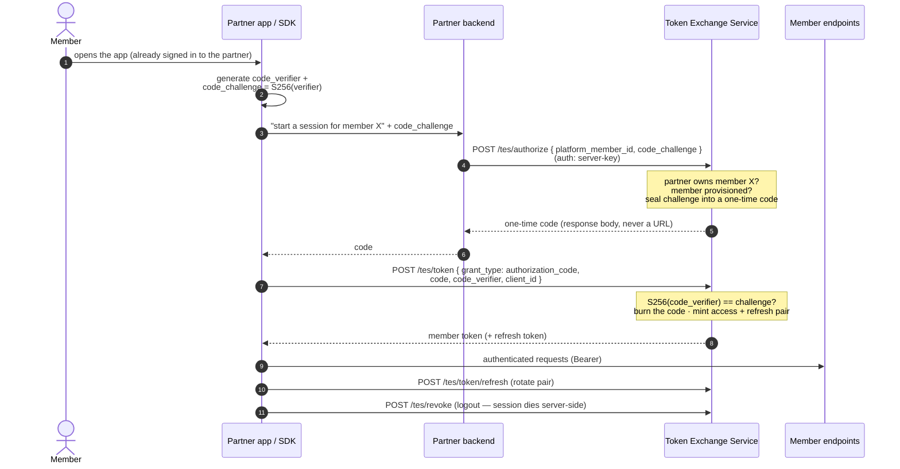

# Backend-vouched authorization code + PKCE, from scratch

An educational Next.js app that implements an **OAuth 2.0-style
authorization-code grant hardened with PKCE**
([RFC 6749](https://datatracker.ietf.org/doc/html/rfc6749) +
[RFC 7636](https://datatracker.ietf.org/doc/html/rfc7636)) — with a twist on
the textbook flow: **there is no browser redirect, no login form, no consent
screen**. The user is already signed in to a *partner's* app; the partner's
backend **vouches** for them, and a **Token Exchange Service (TES)** mints
the one-time code and the member tokens.

Everything is built with **no auth libraries**: just `fetch`, the Web Crypto
API, and Next.js route handlers. All three actors live in this repo, so the
whole flow runs locally with zero registration or configuration:

- the **app / SDK** — the public client; generates the PKCE secret and is
  its only holder;
- the **partner backend** — holds the confidential *server-key* and vouches
  for members it has already authenticated by its own means;
- the **Token Exchange Service** — validates the vouch, resolves the
  member's identity, mints short-lived signed tokens, and owns refresh
  rotation and revocation.

Every intermediate value (verifier, challenge, code, token claims) is
printed on screen as the flow runs — including the failure paths.

## Run it

```bash
npm install
npm run dev
```

Open http://localhost:3000. One button runs the full session arc (vouch →
code → PKCE exchange → API call → refresh rotation → revoke); the other
signs in a member that was never provisioned, to show that path.

## The model in 60 seconds

A partner (an external company integrating the platform's SDK) gets two
credentials:

| Credential | Type | Lives in | Drives |
|---|---|---|---|
| **server-key** | Confidential, machine-to-machine | Partner **backend** | Provisioning members + **vouching** for their sign-in |
| **client-key** | Public (no secret) | Partner **app** (SDK) | Identifies the app; initiates the token exchange |

The member never types a password into the platform: they are already
signed in to the partner's app. Sign-in to the platform is therefore not
"authenticate this user" but "**a trusted partner asserts this is their
member X**" — one server-key-authenticated API call. The TES answers with a
one-time code, and the app swaps it for tokens. The client-key is public by
design and is never the security boundary; the vouch (anchored on the
server-key) is.

## Why PKCE, if there's no redirect?

In the classic flow PKCE protects the code while it rides browser
redirects. Here there are no redirects — but the code still travels through
hands that must not be able to redeem it: **the partner's backend**, its
logs, and the backend→app response hop.

| | Value | Where it goes |
|---|---|---|
| 1 | `code_verifier` — 43 random chars | stays in the app, in memory |
| 2 | `code_challenge = SHA-256(verifier)` | app → partner backend → TES `/tes/authorize` |
| 3 | `code_verifier` (the original) | app → TES `/tes/token`, direct call |

The TES hashes the verifier from step 3 and compares it with the challenge
from step 2. The partner backend only ever saw the hash, and a hash cannot
be reversed — so even the backend that *delivered* the code cannot redeem
it. The code is bound to the one app instance that started the sign-in.

## The flow, end to end



## How this differs from the classic redirect flow

If you've seen the textbook "Sign in with Google"-style flow, map the
differences:

| Classic front-channel flow | This flow (backend-vouched) |
|---|---|
| Provider authenticates the user itself (login + consent page) | Partner already authenticated the member; the **server-key vouch** replaces the login |
| Code issued via `302 → redirect_uri?code=...` — rides a URL | Code returned **in an API response body** — never in a URL |
| `redirect_uri` registration + exact-match validation | No redirect_uri exists |
| `state` parameter defends the callback against CSRF | No callback exists, so no `state` |
| Verifier persisted in `sessionStorage` across the redirect | Verifier stays **in a local variable** — the page never unloads |
| PKCE defends against codes stolen from redirects | PKCE defends against the code's other custodians (**the partner backend**, its logs) |
| Trust anchor: user's login at the provider | Trust anchor: the **server-key**, bound to one organization |

Same grant, same one-time code discipline, same PKCE math — different
channel for issuing the code, and a different party asserting identity.

## Where to read the code

Follow the numbered steps; each file's header comment explains its role and
which ACTOR it belongs to.

| Step | Actor | What happens | File |
|---|---|---|---|
| — | app | PKCE explained + verifier/challenge generation | [`lib/pkce.client.ts`](lib/pkce.client.ts) |
| 1–8 | app | The SDK: drives the whole arc, only holder of the verifier | [`app/sdk-demo.client.tsx`](app/sdk-demo.client.tsx) |
| 2 | partner | Vouch relay: holds the **server-key**, never sees the verifier | [`app/partner/session/route.ts`](app/partner/session/route.ts) |
| 3–4 | TES | Validate the vouch, tenant isolation, mint the one-time code | [`app/tes/authorize/route.ts`](app/tes/authorize/route.ts) |
| 5 | TES | **The PKCE check**, burn the code, mint the token pair | [`app/tes/token/route.ts`](app/tes/token/route.ts) |
| 6 | API | A protected member endpoint verifying the token locally | [`app/pager/member-profile/route.ts`](app/pager/member-profile/route.ts) |
| 7 | TES | Refresh with rotation + identity re-resolution | [`app/tes/token/refresh/route.ts`](app/tes/token/refresh/route.ts) |
| 8 | TES | Revocation: logout that actually works | [`app/tes/revoke/route.ts`](app/tes/revoke/route.ts) |
| — | TES | Registries, token shapes, signing (HMAC), tenant model | [`lib/tes.server.ts`](lib/tes.server.ts) |
| — | app | Public client config (note: nothing confidential) | [`lib/sdk-config.client.ts`](lib/sdk-config.client.ts) |

## Naming convention: where does this code run?

File names tell you which side of the wire each module executes on:

- **`*.client.ts(x)`** — runs in the **browser**: the app/SDK code, the only
  holder of the PKCE verifier.
- **`*.server.ts`** — runs only on the **backend**. `lib/tes.server.ts`
  holds the signing secret and the partner server-keys; it also throws at
  import time if it ever ends up in a browser bundle, so a wrong import
  fails loudly.
- **`*.shared.ts`** — pure helpers safe on both sides
  (`lib/base64url.shared.ts` uses only web-standard APIs).

Next.js reserves some file names that can't carry a suffix. For those:

- `app/**/route.ts` — **always backend**. Here the top-level directory names
  the ACTOR each endpoint belongs to: `app/partner/*` is the partner's
  backend, `app/tes/*` is the Token Exchange Service, and `app/pager/*` is
  the platform's existing member APIs (three separate deployments in real
  life, one repo here so the demo is self-contained).
- `app/**/page.tsx` / `layout.tsx` — backend by default; a file that starts
  with the `"use client"` directive ships to the **browser**.

## Things worth noticing

- **There is no `state` parameter — and that's correct here.** `state`
  defends a redirect callback against CSRF. This flow has no redirect and no
  callback; adding `state` would be cargo-culting. Security controls map to
  channels, not to checklists.
- **The verifier never leaves the app.** It lives in a local variable (not
  even sessionStorage — nothing persists), travels exactly once in the body
  of the direct `/tes/token` call, and is never logged.
- **Tenant isolation is structural.** The server-key is bound to one
  organization and the member lookup is scoped inside it, so a partner
  cannot vouch for — or even probe the existence of — another tenant's
  members. There is no code path for cross-tenant access.
- **Provision-before-sign-in.** Sign-in never creates members; the partner
  backend provisions them ahead of time. An unprovisioned member gets a
  clean, distinct `409 member_not_provisioned` the partner can branch on:
  provision, then retry.
- **Refresh rotation turns theft into a signal.** Each refresh retires the
  old pair; a replayed refresh token fails loudly, which is exactly what
  you want to alert on.
- **Owning the issuer makes logout real.** `/tes/revoke` kills the session
  server-side; the demo proves it by re-calling the member API with the
  just-revoked token. A stateless external issuer cannot do this.
- **The demo's shortcuts are labeled.** Real systems: asymmetric signing
  (RS256/ES256) with published JWKS instead of a shared HMAC secret,
  databases instead of in-memory Sets and in-code registries, a real M2M
  client instead of a static server-key, and a partner backend that derives
  the member id from its own authenticated session instead of trusting the
  request body (see the loud comment in `app/partner/session/route.ts`).

## Exercises

1. Tamper with the exchange: in `app/sdk-demo.client.tsx`, send a wrong
   `code_verifier` and watch `/tes/token` refuse.
2. Replay attack: grab the `code` from the trace and POST it to `/tes/token`
   yourself with `curl`. Which checks stop you, and in what order?
3. Steal the server-key of `globex` (it's in `lib/tes.server.ts`) and try to
   vouch for `ada@acme` with it. What response do you get, and why is it
   indistinguishable from a nonexistent member?
4. The demo's partner backend trusts the `memberId` in the request body.
   Describe the attack that enables, and sketch the fix.
5. Refresh-token theft: capture the refresh token from the trace, "steal"
   it (curl), then let the app refresh first. What happens to your stolen
   token — and what happens if *you* refresh first? What should the TES do
   when it detects the second case?

## Disclaimer

This is a teaching prop. The protocol mechanics (one-time codes, PKCE S256,
rotation, revocation) follow the RFCs and the
[OAuth 2.0 Security BCP](https://datatracker.ietf.org/doc/html/rfc9700)
